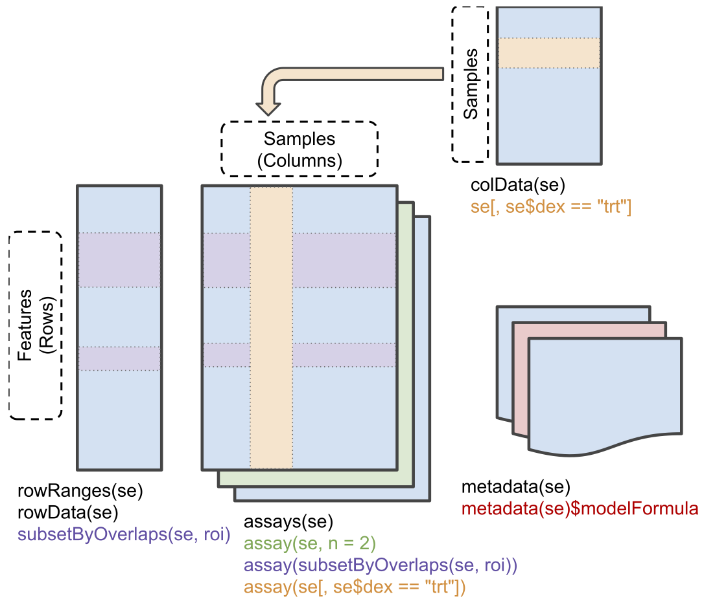

<a rel="license" href="https://creativecommons.org/licenses/by-sa/4.0/"></a>


# The CPTAC Spike-In Study

This case-study is a subset of the data of the 6th study of the
Clinical Proteomic Technology Assessment for Cancer (CPTAC) [5].  In
this experiment, the authors spiked the Sigma Universal Protein
Standard mixture 1 (UPS1) containing 48 different human proteins in a
protein background of 60 ng/$\mu$L Saccharomyces cerevisiae strain
BY4741.

Five different spike-in concentrations were used:

- 6A: 0.25 fmol UPS1 proteins/$\mu L$,
- 6B: 0.74 fmol UPS1 proteins/$\mu L$,
- 6C: 2.22 fmol UPS1 proteins/$\mu L$,
- 6D: 6.67 fmol UPS1 proteins/$\mu L$ and
- 6E: 20 fmol UPS1 proteins/$\mu L$).


The data were searched with MaxQuant version 1.5.2.8, and detailed
search settings were described in Goeminne et al. (2016) [1].  Three
replicates are available for each concentration.

```{r echo=FALSE, out.width="50%"}
knitr::include_graphics("./figures/cptacLayoutLudger.png")
```

# QFeatures: data infrastructure

We will use the `QFeatures` package that provides the infrastructure
to store, process, manipulate and analyse quantitative data/features
from mass spectrometry experiments. It is based on the
`SummarizedExperiment` and `MultiAssayExperiment` classes.

```{r fig.cap = "Conceptual representation of a `SummarizedExperiment` object.  Assays contain information on the measured omics features (rows) for different samples (columns). The `rowData` contains information on the omics features, the `colData` contains information on the samples, i.e. experimental design etc.", echo=FALSE, out.width="80%"}

```

Assays in a QFeatures object have a hierarchical relation:

- proteins are composed of peptides,
- themselves produced by peptide spectrum matches
- relations between assays are tracked and recorded throughout data
  processing

```{r featuresplot, fig.cap = "Conceptual representation of a `QFeatures` object and the aggregative relation between different assays. Image from the [QFeatures vignette](https://rformassspectrometry.github.io/QFeatures/articles/QFeatures.html)", echo = FALSE  }
par(mar = c(0, 0, 0, 0))
plot(NA, xlim = c(0, 12), ylim = c(0, 20),
     xaxt = "n", yaxt = "n",
     xlab = "", ylab = "", bty = "n")
for (i in 0:7)
    rect(0, i, 3, i+1, col = "lightgrey", border = "white")
for (i in 8:12)
    rect(0, i, 3, i+1, col = "steelblue", border = "white")
for (i in 13:18)
    rect(0, i, 3, i+1, col = "orange", border = "white")
for (i in 19)
    rect(0, i, 3, i+1, col = "darkgrey", border = "white")
for (i in 5:7)
    rect(5, i, 8, i+1, col = "lightgrey", border = "white")
for (i in 8:10)
    rect(5, i, 8, i+1, col = "steelblue", border = "white")
for (i in 11:13)
    rect(5, i, 8, i+1, col = "orange", border = "white")
for (i in 14)
    rect(5, i, 8, i+1, col = "darkgrey", border = "white")
rect(9, 8, 12, 8+1, col = "lightgrey", border = "white")
rect(9, 9, 12, 9+1, col = "steelblue", border = "white")
rect(9, 10, 12, 10+1, col = "orange", border = "white")
rect(9, 11, 12, 11+1, col = "darkgrey", border = "white")
segments(3, 8, 5, 8, lty = "dashed")
segments(3, 6, 5, 7, lty = "dashed")
segments(3, 4, 5, 6, lty = "dashed")
segments(3, 0, 5, 5, lty = "dashed")
segments(3, 10, 5, 9, lty = "dashed")
segments(3, 11, 5, 10, lty = "dashed")
segments(3, 13, 5, 11, lty = "dashed")
segments(3, 14, 5, 12, lty = "dashed")
segments(3, 16, 5, 13, lty = "dashed")
segments(3, 19, 5, 14, lty = "dashed")
segments(3, 20, 5, 15, lty = "dashed")
segments(8, 5, 9, 8, lty = "dashed")
segments(8, 8, 9, 9, lty = "dashed")
segments(8, 11, 9, 10, lty = "dashed")
segments(8, 14, 9, 11, lty = "dashed")
segments(8, 15, 9, 12, lty = "dashed")
```

# Data preparation

Let's start by loading the packages that we will need

```{r, warning=FALSE, message=FALSE}
library(tidyverse)
library(limma)
library(QFeatures)
library(msqrob2)
```

## Import data from the CPTAC study

1. We use MS-data quantified with MaxQuant that contains MS1
   intensities summarized at the peptide level. This file contains a
   subset of the data and is available in the `msdata` package.

```{r}
(basename(f <- msdata::quant(full.names = TRUE)))
```

2. Maxquant stores the intensity data for the different samples in
   columnns that start with "Intensity". We can retreive the column
   names with the intensity data with the code below:

```{r}
grep("Intensity\\.", names(read.delim(f)), value = TRUE)
(ecols <- grep("Intensity\\.", names(read.delim(f))))
```

3. Read the data and store it in  QFeatures object

```{r}
qf <- readQFeatures(
    f, fnames = 1, ecol = ecols,
    name = "peptideRaw", sep = "\t")
```

The QFeatures object `qf` currently contains a single assay, named
`peptideRaw`, composed of 11466 peptides measured in 6 samples.

```{r}
qf
```

We can access the unique assay by index (i.e. 1) or by name (i.e
"peptideRaw") using the `[[]]` operator, which returns an instance of
class `SummarizedExperiment`:


```{r}
qf[[1]]
qf[["peptideRaw"]]
```

The quantitative data can be accessed with the `assay()` function

```{r assay}
assay(qf[[1]])[1:10, 1:3]
```

## Explore object

- The `rowData` contains information on the features (peptides) in the
  assay. E.g. Sequence, protein, ...

```{r rowdata}
rowData(qf[["peptideRaw"]])[, c("Proteins", "Sequence", "Charges")]
```

- The `colData` contains information on the samples, but is currently
  empty:

```{r}
colData(qf)
```

- We can rename the primary sample names and assay column names

```{r colnames}
colnames(qf)[[1]]
(new_names <- sub("Intensity\\.", "", colnames(qf)[[1]]))

qf <- renameColname(qf, i = 1, new_names) |>
  renamePrimary(new_names)
```
- We should also update the `colData` with information on the design

```{r coldata}
qf$lab <- rep("lab3", 6)
qf$condition <- qf[["peptideRaw"]] %>%
   colnames %>%
   substr(2, 2) %>%
   as.factor()
qf$spikeConcentration <- rep(c(A = 0.25, B = 0.74),
                             each = 3)
```

```{r}
colData(qf)
```

## Missingness

Peptides with zero intensities are missing peptides and should be
represent with a `NA` value rather than `0`. This can be done with the
`zeroIsNA()` function. We can then use `nNA()` on the individual assay
to compute missingness summaries:

```{r nNA}
qf <- zeroIsNA(qf, "peptideRaw")
na <- nNA(qf[[1]])
na
```

- 31130 peptides intensities, corresponding to 45%, are missing and
  for some peptides we do not even measure a signal in any sample.
- For each sample, the proportion fluctuates between 41.4 and 48.5%.
- The table below shows the number of peptides that have 0, 1, ... and
  up to 6 missing values.

```{r}
table(na$nNArows$nNA)
```

We will want to keep features that are missing in no more than 2
samples.

```{r}
rowData(qf[[1]])$keepNA <- na$nNArows$nNA <= 4
```

# Preprocessing

This section preforms preprocessing for the peptide data.  This
include

- log transformation,
- filtering and
- summarisation of the data.

## Log transform the data

```{r logTransg}
qf <- logTransform(qf, base = 2,
                   i = "peptideRaw",
                   name = "peptideLog")
qf
```

## Filtering

**Handling overlapping protein groups**: in our approach a peptide can
map to multiple proteins, as long as there is none of these proteins
present in a smaller subgroup.

```{r filterSmallestUnique}
sug <- smallestUniqueGroups(rowData(qf[["peptideRaw"]])$Proteins)
filterFeatures(qf, ~ Proteins %in% sug)
```

**Remove reverse sequences (decoys) and contaminants**: we now remove
the contaminants and peptides that map to decoy sequences.

```{r filterRevCont}
filterFeatures(qf, ~ Reverse != "+")
filterFeatures(qf, ~ Potential.contaminant != "+")
```

**Drop peptides that were only identified in one sample**: we keep
peptides that were observed at last twice, i.e. those that have no
more that 4 missing values

```{r filterNA}
filterFeatures(qf, ~ keepNA)
```

Putting it all together:

```{r filtering}
qf <- qf |>
    filterFeatures(~ Proteins %in% sug) |>
    filterFeatures(~ Reverse != "+") |>
    filterFeatures(~ Potential.contaminant != "+") |>
    filterFeatures(~ keepNA)
qf
```

We keep `r nrow(qf[["peptideLog"]])` peptides upon filtering.

## Normalisation

We normalise the data by substracting the sample median from every
intensity for peptide $p$ in a sample $i$:

$$y_{ip}^\text{norm} = y_{ip} - \hat\mu_i$$

with $\hat\mu_i$ the median intensity over all observed peptides in
sample $i$.

```{r normalise}
qf <- normalize(qf,
                i = "peptideLog",
                name = "peptideNorm",
                method = "center.median")
qf
```

## Explore normalized data

Upon the normalisation the density curves follow a similar distribution.

```{r densityplot}
as_tibble(longFormat(qf[, , 2:3], colvars = "condition")) %>%
    ggplot(aes(x = value, group = primary, colour = condition)) +
    geom_density() +
    facet_grid(assay ~ .) +
    theme_bw()
```

We can visualize our data using a Multi Dimensional Scaling plot,
eg. as provided by the `limma` package.

```{r mdsplot}
assay(qf[["peptideNorm"]]) |>
    limma::plotMDS(col = as.numeric(qf$condition))
```

The first axis in the plot is showing the leading log fold changes
(differences on the log scale) between the samples. We notice that the
leading differences in the peptide data seems to be driven by
technical variability.  Indeed, the samples do not seem to be clearly
separated according to the spike-in condition.


## Protein aggregation

- We use median summarization in aggregateFeatures.
- Note, that this is a suboptimal normalisation procedure!
- By default robust summarization is used:  `fun = MsCoreUtils::robustSummary()`

```{r,warning=FALSE}
qf <- aggregateFeatures(qf,
  i = "peptideNorm",
  fcol = "Proteins",
  na.rm = TRUE,
  name = "proteinMedian",
  fun = matrixStats::colMedians)
qf
```

```{r}
assay(qf[["proteinMedian"]]) %>%
  limma::plotMDS(col = as.numeric(qf$condition))
```

# Data Analysis

## Estimation

We model the protein level expression values using `msqrob`.  By
default `msqrob2` estimates the model parameters using robust
regression.

We will model the data with a different group mean.  The group is
incoded in the variable `condition` of the colData.  We can specify
this model by using a formula with the factor condition as its
predictor: `formula = ~condition`.

Note, that a formula always starts with a symbol '~'.

```{r msqrob, warning=FALSE}
qf <- msqrob(object = qf,
             i = "proteinMedian",
             formula = ~condition,
             overwrite = TRUE)
```

```{r}
rowData(qf[["proteinMedian"]])[, c("Proteins", ".n", "msqrobModels")]
```


## Inference

First, we extract the parameter names of the model by looking at the
first model.  The models are stored in the row data of the assay under
the default name msqrobModels.

```{r}
getCoef(rowData(qf[["proteinMedian"]])$msqrobModels[[1]])
```

We can also explore the design of the model that we specified using
the the package `ExploreModelMatrix`

```{r}
library(ExploreModelMatrix)
VisualizeDesign(colData(qf),~condition)$plotlist[[1]]
```

Spike-in condition `A` is the reference class. So the mean log2
expression for samples from condition A is '(Intercept).  The mean
log2 expression for samples from condition B is
'(Intercept)+conditionB'.

Hence, the average log2 fold change between condition b and condition
a is modelled using the parameter 'conditionB'.  Thus, we assess the
contrast 'conditionB = 0' with our statistical test.


```{r}
L <- makeContrast("conditionB=0", parameterNames = c("conditionB"))
qf <- hypothesisTest(object = qf, i = "proteinMedian", contrast = L)
```


## Volcano plot


```{r,warning=FALSE}
tmp <- rowData(qf[["proteinMedian"]])$conditionB[complete.cases(rowData(qf[["proteinMedian"]])$conditionB),]
tmp$shapes <- 16

volcanoMedian<- ggplot(tmp,
                  aes(x = logFC, y = -log10(pval), color = adjPval < 0.05)) +
  geom_point(cex = 2.5, shape = tmp$shapes) +
  #geom_point(x =FP$logFC, y = -log10(FP$pval), shape = 8, size = 4 )+
  scale_color_manual(values = alpha(c("black", "red"), 0.5)) +
  theme_bw() +
  ggtitle(paste0("Median: TP = ",sum(tmp$adjPval<0.05&grepl(rownames(tmp),pattern ="UPS"),na.rm=TRUE), " FP = ", sum(tmp$adjPval<0.05&!grepl(rownames(tmp),pattern ="UPS"),na.rm=TRUE)))
volcanoMedian

```

Note, that only `r sum(rowData(qf[["proteinMedian"]])$conditionB$adjPval < 0.05, na.rm = TRUE)` proteins are found to be differentially abundant.

## Heatmap

We first select the names of the proteins that were declared significant

```{r}
sigNames <- rowData(qf[["proteinMedian"]])$conditionB %>%
  rownames_to_column("proteinMedian") %>%
  filter(adjPval < 0.05) %>%
  pull(proteinMedian)

heatmap(assay(qf[["proteinMedian"]][sigNames, ]),cexRow = 1, cexCol = 1)

sigProteins <- rowData(qf[["proteinMedian"]])$conditionB %>%
  rownames_to_column("proteinMedian") %>%
   filter(grepl("UPS",proteinMedian)) %>%
  pull(proteinMedian)

heatmap(assay(qf[["proteinMedian"]])[sigProteins, ], cexCol = 1)
```

The majority of the proteins are indeed UPS proteins.  1 yeast protein
is returned.  Note, that the yeast protein indeed shows evidence for
differential abundance.

## Boxplots

We create a boxplot of the log2 FC and group according to the whether a protein is spiked or not.

```{r}
rowData(qf[["proteinMedian"]])$conditionB %>%
  rownames_to_column(var = "protein") %>%
  mutate(ups=grepl("UPS",protein)) %>%
  ggplot(aes(x=ups, y =logFC, fill = ups)) +
  geom_boxplot() +
  theme_bw() +
  geom_hline(yintercept = log2(0.74 / .25), color = "#00BFC4") +
    geom_hline(yintercept = 0, color = "#F8766D")

```


# Session Info

With respect to reproducibility, it is highly recommended to include a
session info in your script so that readers of your output can see
your particular setup of R.

```{r}
sessionInfo()
```
