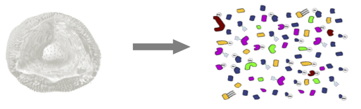
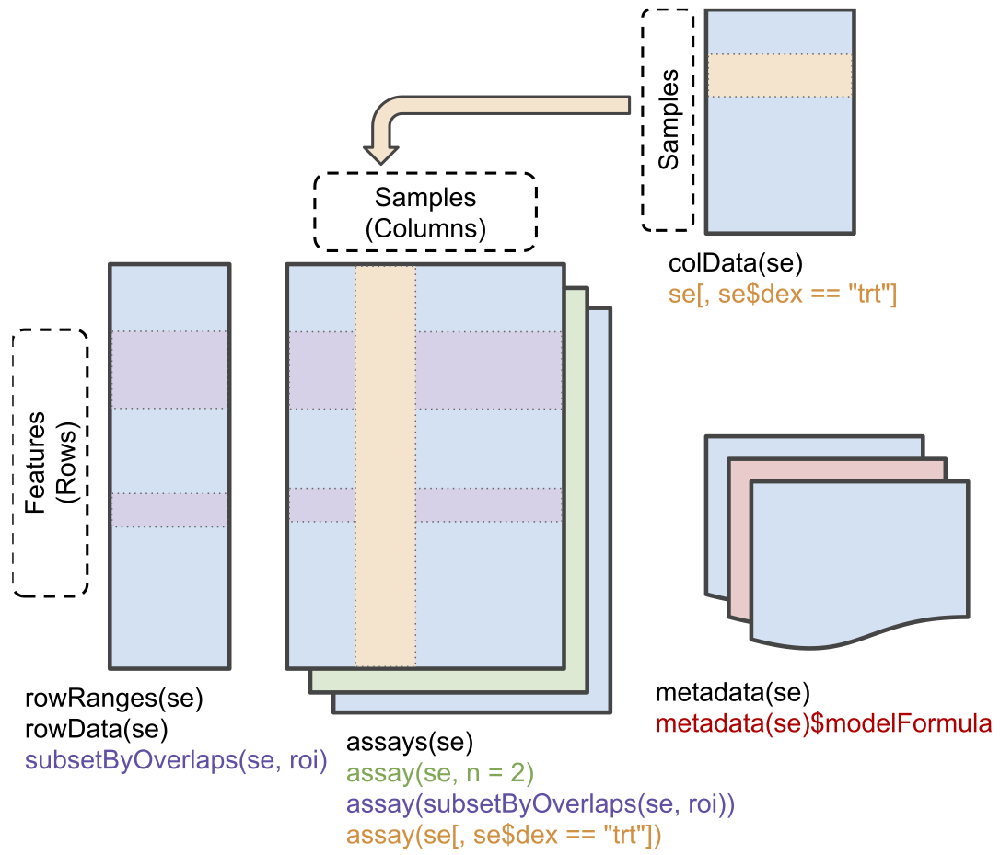

<a rel="license" href="https://creativecommons.org/licenses/by-nc-sa/4.0"></a>

This is part of the online course [Proteomics Data Analysis (PDA)](https://statomics.github.io/PDA/)


# Intro: Challenges in Label-Free Quantitative Proteomics

## MS-based workflow

```{r echo=FALSE}
knitr::include_graphics("./figures/ProteomicsWorkflow.png")
```
  
- Peptide Characteristics
  
  - Modifications
  - Ionisation Efficiency: huge variability
  - Identification
    - Misidentification $\rightarrow$ outliers
    - MS$^2$ selection on peptide abundance
    - Context depending missingness
    - Non-random missingness

$\rightarrow$ Unbalanced pepide identifications across samples and messy data

---

## Level of quantification

- MS-based proteomics returns peptides: pieces of proteins

```{r echo=FALSE}

```

- Quantification commonly required on the protein level

```{r echo=FALSE}

```

---

## Label-free Quantitative Proteomics Data Analysis Workflows

```{r echo=FALSE}
knitr::include_graphics("./figures/proteomicsDataAnalysis.png")
```

---


# QFeatures

## Data infrastructure

- We use the `QFeatures` package that provides the infrastructure to
  - store,  
  - process, 
  - manipulate and 
  - analyse quantitative data/features from mass spectrometry
experiments. 

- It is based on the `SummarizedExperiment` and
`MultiAssayExperiment` classes. 

```{r fig.cap = "Conceptual representation of a `SummarizedExperiment` object.  Assays contain information on the measured omics features (rows) for different samples (columns). The `rowData` contains information on the omics features, the `colData` contains information on the samples, i.e. experimental design etc.", echo=FALSE, out.width="80%"}

```

- Assays in a QFeatures object have a
hierarchical relation: 
  
  - proteins are composed of peptides, 
  - themselves produced by spectra
  - relations between assays are tracked and recorded throughout data processing

```{r featuresplot, fig.cap = "Conceptual representation of a `QFeatures` object and the aggregative relation between different assays.", echo = FALSE  }
par(mar = c(0, 0, 0, 0))
plot(NA, xlim = c(0, 12), ylim = c(0, 20),
     xaxt = "n", yaxt = "n",
     xlab = "", ylab = "", bty = "n")
for (i in 0:7)
    rect(0, i, 3, i+1, col = "lightgrey", border = "white")
for (i in 8:12)
    rect(0, i, 3, i+1, col = "steelblue", border = "white")
for (i in 13:18)
    rect(0, i, 3, i+1, col = "orange", border = "white")
for (i in 19)
    rect(0, i, 3, i+1, col = "darkgrey", border = "white")
for (i in 5:7)
    rect(5, i, 8, i+1, col = "lightgrey", border = "white")
for (i in 8:10)
    rect(5, i, 8, i+1, col = "steelblue", border = "white")
for (i in 11:13)
    rect(5, i, 8, i+1, col = "orange", border = "white")
for (i in 14)
    rect(5, i, 8, i+1, col = "darkgrey", border = "white")
rect(9, 8, 12, 8+1, col = "lightgrey", border = "white")
rect(9, 9, 12, 9+1, col = "steelblue", border = "white")
rect(9, 10, 12, 10+1, col = "orange", border = "white")
rect(9, 11, 12, 11+1, col = "darkgrey", border = "white")
segments(3, 8, 5, 8, lty = "dashed")
segments(3, 6, 5, 7, lty = "dashed")
segments(3, 4, 5, 6, lty = "dashed")
segments(3, 0, 5, 5, lty = "dashed")
segments(3, 10, 5, 9, lty = "dashed")
segments(3, 11, 5, 10, lty = "dashed")
segments(3, 13, 5, 11, lty = "dashed")
segments(3, 14, 5, 12, lty = "dashed")
segments(3, 16, 5, 13, lty = "dashed")
segments(3, 19, 5, 14, lty = "dashed")
segments(3, 20, 5, 15, lty = "dashed")
segments(8, 5, 9, 8, lty = "dashed")
segments(8, 8, 9, 9, lty = "dashed")
segments(8, 11, 9, 10, lty = "dashed")
segments(8, 14, 9, 11, lty = "dashed")
segments(8, 15, 9, 12, lty = "dashed")
```


# Background of the CPTAC Spike-In Study
This case-study is a subset of the data of the 6th study of the Clinical
Proteomic Technology Assessment for Cancer (CPTAC).
In this experiment, the authors spiked the Sigma Universal Protein Standard
mixture 1 (UPS1) containing 48 different human proteins in a protein background
of 60 ng/$\mu$L Saccharomyces cerevisiae strain BY4741.


Five different spike-in concentrations were used:
(6A: 0.25 fmol UPS1 proteins/$\mu L$; 6B: 0.74 fmol UPS1 proteins/$\mu L$; 6C: 2.22 fmol UPS1 proteins/$\mu L$; 6D: 6.67 fmol UPS1 proteins/$\mu L$; and 6E: 20 fmol UPS1 proteins/$\mu L$) [5].


We limited ourselves to the data of LTQ-Orbitrap W at site 56.
The data were searched with MaxQuant version 1.5.2.8, and
detailed search settings were described in Goeminne et al. (2016) [1].
Three replicates are available for each concentration.

```{r echo=FALSE, out.width="50%"}
knitr::include_graphics("./figures/cptacLayoutLudger.png")
```

- After MaxQuant search with match between runs option
  - 41\% of all proteins are quantified in all samples
  - 6.6\% of all peptides are quantified in all samples

$\rightarrow$ vast amount of missingness


## Import data in R


### Load libraries 

```{r, warning=FALSE, message=FALSE}
library(tidyverse)
library(limma)
library(QFeatures)
library(msqrob2)
library(plotly)
library(ggplot2)
library(cowplot)
library(gridExtra)
```
</p></details>

### Import data from the CPTAC study
1. We use a peptides.txt file from MS-data quantified with maxquant that 
contains MS1 intensities summarized at the peptide level. 
```{r}
peptidesFile <- "https://raw.githubusercontent.com/statOmics/PDA/data/quantification/fullCptacDatasSetNotForTutorial/peptides.txt"
```

2. Maxquant stores the intensity data for the different samples in columnns that start with Intensity. We can retreive the column names with the intensity data with the code below: 

```{r}
ecols <- grep("Intensity\\.", names(read.delim(peptidesFile)))
```

3. Read the data and store it in  QFeatures object 

```{r}
pe <- readQFeatures(
  table = peptidesFile,
  fnames = 1,
  ecol = ecols,
  name = "peptideRaw", sep="\t")
```


### Explore object

- The rowData contains information on the features (peptides) in the assay. E.g. Sequence, protein, ...

```{r}
head(rowData(pe[["peptideRaw"]])[,c("Proteins","Sequence","Charges","Intensity",
                                    "Experiment.6A_7","Experiment.6A_8","Experiment.6A_9" )])
```

- The colData contains information on the samples

```{r} 
colData(pe)
```

- No information is stored yet on the design. 


```{r} 
pe %>% colnames
```

- Note, that the sample names include the spike-in condition. 
- They also end on a number. 
  
  - 1-3 is from lab 1, 
  - 4-6 from lab 2 and 
  - 7-9 from lab 3. 

- We update the colData with information on the design

```{r}
colData(pe)$lab <- rep(rep(paste0("lab",1:3),each=3),5) %>% as.factor
colData(pe)$condition <- pe[["peptideRaw"]] %>% colnames %>% substr(12,12) %>% as.factor
colData(pe)$spikeConcentration <- rep(c(A = 0.25, B = 0.74, C = 2.22, D = 6.67, E = 20),each = 9)
```

- We explore the colData again

```{r}
colData(pe)
```


# Import subset of the CPTAC study

We first import the data from peptideRaws.txt file. This is the file containing
your peptideRaw-level intensities. For a MaxQuant search [6],
this peptideRaws.txt file can be found by default in the
"path_to_raw_files/combined/txt/" folder from the MaxQuant output,
with "path_to_raw_files" the folder where the raw files were saved.
In this vignette, we use a MaxQuant peptideRaws file which is a subset
of the cptac study. This data is available in the `msdata` package.
To import the data we use the `QFeatures` package.

We generate the object peptideRawFile with the path to the peptideRaws.txt file.
Using the `grepEcols` function, we find the columns that contain the expression
data of the peptideRaws in the peptideRaws.txt file.


```{r, warning=FALSE, message=FALSE}
peptidesFile <- "https://raw.githubusercontent.com/statOmics/SGA2020/data/quantification/cptacAvsB_lab3/peptides.txt"

ecols <- grep(
  "Intensity\\.", 
  names(read.delim(peptidesFile))
  )

pe <- readQFeatures(
  table = peptidesFile,
  fnames = 1,
  ecol = ecols,
  name = "peptideRaw", sep="\t")

colnames(pe)
```

In the following code chunk, we can extract the spikein condition from the raw file name.

```{r}
cond <- which(
  strsplit(colnames(pe)[[1]][1], split = "")[[1]] == "A") # find where condition is stored

colData(pe)$condition <- substr(colnames(pe), cond, cond) %>%
  unlist %>%  
  as.factor
```


We calculate how many non zero intensities we have per peptide and this
will be useful for filtering.

```{r}
rowData(pe[["peptideRaw"]])$nNonZero <- rowSums(assay(pe[["peptideRaw"]]) > 0)
```


Peptides with zero intensities are missing peptides and should be represent
with a `NA` value rather than `0`.
```{r}
pe <- zeroIsNA(pe, "peptideRaw") # convert 0 to NA
```


## Missingness

`r format(mean(is.na(assay(pe[["peptideRaw"]])))*100,digits=2)`% of all peptide
intensities are missing and for some peptides we do not even measure a signal
in any sample.


# Preprocessing

This section preforms preprocessing for the peptide data. 
This include 

- log transformation, 
- filtering and 
- summarisation of the data.

## Log transform the data

```{r}
pe <- logTransform(pe, base = 2, i = "peptideRaw", name = "peptideLog")
```

## Filtering

1. Handling overlapping protein groups

In our approach a peptide can map to multiple proteins, as long as there is
none of these proteins present in a smaller subgroup.

```{r}
pe <- filterFeatures(pe, ~ Proteins %in% smallestUniqueGroups(rowData(pe[["peptideLog"]])$Proteins))
```

2. Remove reverse sequences (decoys) and contaminants

We now remove the contaminants and peptides that map to decoy sequences.

```{r}
pe <- filterFeatures(pe,~ Reverse != "+")
pe <- filterFeatures(pe,~ Potential.contaminant != "+")
```

3. Drop peptides that were only identified in one sample

We keep peptides that were observed at last twice.

```{r}
pe <- filterFeatures(pe,~ nNonZero >=2)
nrow(pe[["peptideLog"]])
```

We keep `r nrow(pe[["peptideLog"]])` peptides upon filtering.


## Normalize the data using median centering 

We normalize the data by substracting the sample median from every intensity for peptide $p$  in a sample $i$: 

$$y_{ip}^\text{norm} = y_{ip} - \hat\mu_i$$ 

with $\hat\mu_i$ the median intensity over all observed peptides in sample $i$.

```{r}
pe <- normalize(pe, 
                i = "peptideLog", 
                name = "peptideNorm", 
                method = "center.median")
```


## Explore normalized data

Upon the normalisation the density curves follow a similar distribution.

```{r}
pe[["peptideLog"]] %>% 
  assay %>%
  as.data.frame() %>%
  gather(sample, intensity) %>% 
  mutate(condition = colData(pe)[sample,"condition"]) %>%
  ggplot(aes(x = intensity,group = sample,color = condition)) + 
    geom_density()+
  theme_bw() +
  ggtitle("Before median centering")

pe[["peptideNorm"]] %>% 
  assay %>%
  as.data.frame() %>%
  gather(sample, intensity) %>% 
  mutate(condition = colData(pe)[sample,"condition"]) %>%
  ggplot(aes(x = intensity,group = sample,color = condition)) + 
    geom_density() +
  theme_bw()+
  ggtitle("After median centering")


```

We can visualize our data using a Multi Dimensional Scaling plot,
eg. as provided by the `limma` package.

```{r}
tmp <- assay(pe[["peptideNorm"]] )
colnames(tmp) <- str_replace_all(colnames(tmp), "Intensity.6","")
tmp %>%
  limma::plotMDS(col = as.numeric(colData(pe)$condition))
```

The first axis in the plot is showing the leading log fold changes
(differences on the log scale) between the samples.

We notice that the leading differences (log FC)
in the peptide data seems to be driven by technical variability.
Indeed, the samples do not seem to be clearly separated according
to the spike-in condition.


# Median summarization

## Preprocessing
- We use median summarization in aggregateFeatures.
- Note, that this is a suboptimal normalisation procedure! 
- By default robust summarization is used:  `fun = MsCoreUtils::robustSummary()`

```{r,warning=FALSE}
pe <- aggregateFeatures(pe,
  i = "peptideNorm",
  fcol = "Proteins",
  na.rm = TRUE,
  name = "protein_median",
  fun = matrixStats::colMedians)
```


```{r}
tmp <- assay(pe[["protein_median"]] )
colnames(tmp) <- str_replace_all(colnames(tmp), "Intensity.6","")
tmp %>%
  limma::plotMDS(col = as.numeric(colData(pe)$condition))
```


## Data Analysis

### Estimation

We model the protein level expression values using `msqrob`.
By default `msqrob2` estimates the model parameters using robust regression.

We will model the data with a different group mean. 
The group is incoded in the variable `condition` of the colData. 
We can specify this model by using a formula with the factor condition as its predictor: 
`formula = ~condition`.

Note, that a formula always starts with a symbol '~'.

```{r, warning=FALSE}
pe <- msqrob(object = pe, i = "protein_median", formula = ~condition, overwrite=TRUE)
```

```{r}
rowData(pe[["protein_median"]])[,c("Proteins",".n","msqrobModels")]
```


### Inference

First, we extract the parameter names of the model by looking at the first model. 
The models are stored in the row data of the assay under the default name msqrobModels. 

```{r}
getCoef(rowData(pe[["protein_median"]])$msqrobModels[[1]])
```

We can also explore the design of the model that we specified using the the package `ExploreModelMatrix` 

```{r}
library(ExploreModelMatrix)
VisualizeDesign(colData(pe),~condition)$plotlist[[1]]
```

Spike-in condition `A` is the reference class. So the mean log2 expression
for samples from condition A is '(Intercept).
The mean log2 expression for samples from condition B is '(Intercept)+conditionB'.
Hence, the average log2 fold change between condition b and
condition a is modelled using the parameter 'conditionB'.
Thus, we assess the contrast 'conditionB = 0' with our statistical test.

```{r}
L <- makeContrast("conditionB=0", parameterNames = c("conditionB"))
pe <- hypothesisTest(object = pe, i = "protein_median", contrast = L)
```


### Plots

#### Volcano-plot


```{r,warning=FALSE}
tmp <- rowData(pe[["protein_median"]])$conditionB[complete.cases(rowData(pe[["protein_median"]])$conditionB),]
tmp$shapes <- 16

volcanoMedian<- ggplot(tmp,
                  aes(x = logFC, y = -log10(pval), color = adjPval < 0.05)) +
  geom_point(cex = 2.5, shape = tmp$shapes) +
  #geom_point(x =FP$logFC, y = -log10(FP$pval), shape = 8, size = 4 )+
  scale_color_manual(values = alpha(c("black", "red"), 0.5)) + 
  theme_bw() +
  ggtitle(paste0("Median: TP = ",sum(tmp$adjPval<0.05&grepl(rownames(tmp),pattern ="UPS"),na.rm=TRUE), " FP = ", sum(tmp$adjPval<0.05&!grepl(rownames(tmp),pattern ="UPS"),na.rm=TRUE))) 
volcanoMedian

```

Note, that only `r sum(rowData(pe[["protein_median"]])$conditionB$adjPval < 0.05, na.rm = TRUE)` proteins are found to be differentially abundant.

#### Heatmap

We first select the names of the proteins that were declared significant

```{r}
sigNames <- rowData(pe[["protein_median"]])$conditionB %>%
  rownames_to_column("protein_median") %>%
  filter(adjPval<0.05) %>%
  pull(protein_median)
 heatmap(assay(pe[["protein_median"]])[sigNames, ],cexRow = 1, cexCol = 1)
 
 sigProteins <- rowData(pe[["protein_median"]])$conditionB %>%
  rownames_to_column("protein_median") %>%
   filter(grepl("UPS",protein_median)) %>%
  pull(protein_median)
 heatmap(assay(pe[["protein_median"]])[sigProteins, ], cexCol = 1)
 
 
```

The majority of the proteins are indeed UPS proteins. 
1 yeast protein is returned. 
Note, that the yeast protein indeed shows evidence for differential abundance. 

#### Boxplots

We create a boxplot of the log2 FC and group according to the whether a protein is spiked or not.

```{r}
rowData(pe[["protein_median"]])$conditionB %>%
  rownames_to_column(var = "protein") %>%
  mutate(ups=grepl("UPS",protein)) %>%
  ggplot(aes(x=ups, y =logFC, fill = ups)) +
  geom_boxplot() + 
  theme_bw() + 
  geom_hline(yintercept = log2(0.74 / .25), color = "#00BFC4") +
    geom_hline(yintercept = 0, color = "#F8766D")

```

# Robust summarization

## Preprocessing

- By default robust summarization is used:  `fun = MsCoreUtils::robustSummary()`
- Structure from QFeatures is usefull here. No need to rerun any of the previous log transformation or normalization.
```{r,warning=FALSE}
pe <- aggregateFeatures(pe,
  i = "peptideNorm",
  fcol = "Proteins",
  na.rm = TRUE,
  name = "protein_robust",
  fun = MsCoreUtils::robustSummary)
```

Now we have both the protein_median and protein_robust in one QFeatures object.
```{r}
pe
```


```{r}
tmp <- assay(pe[["protein_robust"]] )
colnames(tmp) <- str_replace_all(colnames(tmp), "Intensity.6","")
tmp %>%
  limma::plotMDS(col = as.numeric(colData(pe)$condition))
```

Note that the samples upon robust summarisation show a clear separation according to the spike-in condition in the second dimension of the MDS plot.

## Data Analysis

### Estimation

We model the protein level expression values using `msqrob`.
By default `msqrob2` estimates the model parameters using robust regression.

We will model the data with a different group mean. 
The group is incoded in the variable `condition` of the colData. 
We can specify this model by using a formula with the factor condition as its predictor: 
`formula = ~condition`.

Note, that a formula always starts with a symbol '~'.

```{r, warning=FALSE}
pe <- msqrob(object = pe, i = "protein_robust", formula = ~condition)
```

### Inference

First, we extract the parameter names of the model by looking at the first model. 
The models are stored in the row data of the assay under the default name msqrobModels. 

```{r}
getCoef(rowData(pe[["protein_robust"]])$msqrobModels[[1]])
```

We can also explore the design of the model that we specified using the the package `ExploreModelMatrix` 

```{r}
library(ExploreModelMatrix)
VisualizeDesign(colData(pe),~condition)$plotlist[[1]]
```

Spike-in condition `A` is the reference class. So the mean log2 expression
for samples from condition A is '(Intercept).
The mean log2 expression for samples from condition B is '(Intercept)+conditionB'.
Hence, the average log2 fold change between condition b and
condition a is modelled using the parameter 'conditionB'.
Thus, we assess the contrast 'conditionB = 0' with our statistical test.

```{r}
L <- makeContrast("conditionB=0", parameterNames = c("conditionB"))
pe <- hypothesisTest(object = pe, i = "protein_robust", contrast = L)
```


### Plots

#### Volcano-plot


```{r,warning=FALSE}
tmp <- rowData(pe[["protein_robust"]])$conditionB[complete.cases(rowData(pe[["protein_robust"]])$conditionB),]

tmp$shapes <- 16
tmp[!grepl("UPS",rownames(tmp)) & tmp$adjPval < 0.05,]$shapes <- 12
#FP <-tmp[!grepl("UPS",rownames(tmp)) & tmp$adjPval < 0.05,]
volcanoRobust<- ggplot(tmp,
                  aes(x = logFC, y = -log10(pval), color = adjPval < 0.05)) +
  geom_point(cex = 2.5, shape = tmp$shapes) +
  #geom_point(x =FP$logFC, y = -log10(FP$pval), shape = 8, size = 4 )+
  scale_color_manual(values = alpha(c("black", "red"), 0.5)) + 
  theme_bw() +
  ggtitle(paste0("Robust: TP = ",sum(tmp$adjPval<0.05&grepl(rownames(tmp),pattern ="UPS"),na.rm=TRUE), " FP = ", sum(tmp$adjPval<0.05&!grepl(rownames(tmp),pattern ="UPS"),na.rm=TRUE))) 


plot_grid(plot_grid(volcanoMedian+theme(legend.position = "none"),
          volcanoRobust+theme(legend.position = "none")), get_legend(volcanoRobust + theme(legend.position = "bottom")), ncol = 1, rel_heights = c(1,0.15))

```

Note, that `r sum(rowData(pe[["protein_robust"]])$conditionB$adjPval < 0.05, na.rm = TRUE)` proteins are found to be differentially abundant.

#### Heatmap

We first select the names of the proteins that were declared signficant.

```{r}
sigNames <- rowData(pe[["protein_robust"]])$conditionB %>%
  rownames_to_column("protein_robust") %>%
  filter(adjPval<0.05) %>%
  pull(protein_robust)
heatmap(assay(pe[["protein_robust"]])[sigNames, ],cexCol = 1)

```
The majority of the proteins are indeed UPS proteins. 
1 yeast protein is returned. 
Note, that the yeast protein indeed shows evidence for differential abundance. 

heatmaps also show difference between median and robust summarization
```{r}
par(cex.main=.8)  
sigProteins <- rowData(pe[["protein_robust"]])$conditionB %>%
  rownames_to_column("protein_robust") %>%
   filter(grepl("UPS",protein_robust)) %>%
  pull(protein_robust)
heatmap(assay(pe[["protein_robust"]])[sigProteins, ], cexCol = 1,cexRow = 0.5, main = "Robust summarization")
```


#### Boxplots

We make boxplot of the log2 FC and stratify according to the whether a protein is spiked or not.

```{r}
rbind(rowData(pe[["protein_robust"]])$conditionB %>%
  rownames_to_column(var = "protein") %>% mutate(method = "robust"),
  rowData(pe[["protein_median"]])$conditionB %>%
  rownames_to_column(var = "protein") %>% mutate(method = "median"))%>%
  mutate(ups=grepl("UPS",protein)) %>%
  ggplot(aes(x=method, y =logFC, fill = ups)) +
  geom_boxplot() + 
  theme_bw() + 
  geom_hline(yintercept = log2(0.74 / .25), color = "#00BFC4") +
    geom_hline(yintercept = 0, color = "#F8766D")

```

# Where the difference comes from

## Import data from the full CPTAC study 

<details><summary> Click to see background and code </summary><p>
1. We use a peptides.txt file from MS-data quantified with maxquant that 
contains MS1 intensities summarized at the peptide level. 
```{r}
peptidesFile <- "https://raw.githubusercontent.com/statOmics/PDA/data/quantification/fullCptacDatasSetNotForTutorial/peptides.txt"

```

2. Maxquant stores the intensity data for the different samples in columnns that start with Intensity. We can retreive the column names with the intensity data with the code below: 

```{r}
ecols <- grep("Intensity\\.", names(read.delim(peptidesFile)))
```

3. Read the data and store it in  QFeatures object 

```{r}
pe <- readQFeatures(
  table = peptidesFile,
  fnames = 1,
  ecol = ecols,
  name = "peptideRaw", sep="\t")
```
</p></details>

### Design

<details><summary> Click to see background and code </summary><p>

```{r} 
pe %>% colnames
```

- Note, that the sample names include the spike-in condition. 
- They also end on a number. 
  
  - 1-3 is from lab 1, 
  - 4-6 from lab 2 and 
  - 7-9 from lab 3. 

- We update the colData with information on the design

```{r}
colData(pe)$lab <- rep(rep(paste0("lab",1:3),each=3),5) %>% as.factor
colData(pe)$condition <- pe[["peptideRaw"]] %>% colnames %>% substr(12,12) %>% as.factor
colData(pe)$spikeConcentration <- rep(c(A = 0.25, B = 0.74, C = 2.22, D = 6.67, E = 20),each = 9)
```

- We explore the colData

```{r}
colData(pe)
```

</p></details>

### Preprocessing

<details><summary> Click to see R-code to preprocess the data </summary><p>

- We calculate how many non zero intensities we have for each peptide and this can be useful for filtering.

```{r}
rowData(pe[["peptideRaw"]])$nNonZero <- rowSums(assay(pe[["peptideRaw"]]) > 0)
```


- Peptides with zero intensities are missing peptides and should be represent
with a `NA` value rather than `0`.

```{r}
pe <- zeroIsNA(pe, "peptideRaw") # convert 0 to NA
```

- Logtransform data with base 2

```{r}
pe <- logTransform(pe, base = 2, i = "peptideRaw", name = "peptideLog")
```
</p></details>


1. Handling overlapping protein groups

In our approach a peptide can map to multiple proteins, as long as there is
none of these proteins present in a smaller subgroup.

```{r}
pe <- filterFeatures(pe, ~ Proteins %in% smallestUniqueGroups(rowData(pe[["peptideLog"]])$Proteins))
```

2. Remove reverse sequences (decoys) and contaminants

We now remove the contaminants, peptides that map to decoy sequences, and proteins
which were only identified by peptides with modifications.

```{r}
pe <- filterFeatures(pe,~Reverse != "+")
pe <- filterFeatures(pe,~ Potential.contaminant != "+")
```

3. Drop peptides that were only identified in one sample

We keep peptides that were observed at last twice.

```{r}
pe <- filterFeatures(pe,~ nNonZero >=2)
nrow(pe[["peptideLog"]])
```

We keep `r nrow(pe[["peptideLog"]])` peptides upon filtering.
</p></details>

### Normalization 

<details><summary> Click to see R-code to normalize the data </summary><p>
```{r}
pe <- normalize(pe, 
                i = "peptideLog", 
                name = "peptideNorm", 
                method = "center.median")
```
</p></details>

---

## Peptide-Level view

### Summarization 


<details><summary> Click to see code to make plot </summary><p>
```{r plot = FALSE}

prot <- "P01031ups|CO5_HUMAN_UPS"
data <- pe[["peptideNorm"]][
  rowData(pe[["peptideNorm"]])$Proteins == prot,
  colData(pe)$lab=="lab3"] %>%
  assay %>%
  as.data.frame %>%
  rownames_to_column(var = "peptide") %>%
  gather(sample, intensity, -peptide) %>% 
  mutate(condition = colData(pe)[sample,"condition"]) %>%
  na.exclude
sumPlot <- data %>%
  ggplot(aes(x = peptide, y = intensity, color = condition, group = sample, label = condition), show.legend = FALSE) +
  geom_text(show.legend = FALSE) +
  theme_minimal() +
  theme(axis.text.x = element_text(angle = 90, vjust = 0.5, hjust = 1)) +
  xlab("Peptide") + 
  ylab("Intensity (log2)") +
  ggtitle(paste0("protein: ",prot))
```
</p></details>


Here, we will focus on the summarization of the intensities for protein `r prot` from Lab3 for all conditions.

```{r}
sumPlot +
  geom_line(linetype="dashed",alpha=.4)
```

#### Median summarization

We first evaluate median summarization for protein `r prot`.

<details><summary> Click to see code to make plot </summary><p>
```{r}
dataHlp <- pe[["peptideNorm"]][
    rowData(pe[["peptideNorm"]])$Proteins == prot,
    colData(pe)$lab=="lab3"] %>% assay 

sumMedian <- data.frame(
  intensity= dataHlp
    %>% colMedians(na.rm=TRUE)
  ,
  condition= colnames(dataHlp) %>% substr(12,12) %>% as.factor )

sumMedianPlot <- sumPlot + 
  geom_hline(
    data = sumMedian,
    mapping = aes(yintercept=intensity,color=condition)) + 
  ggtitle("Median summarization")
```
</p></details>

```{r}
sumMedianPlot
```


- The sample medians are not a good estimate for the protein expression value. 
- Indeed, they do not account for differences in peptide effects
- Peptides that ionize poorly are also picked up in samples with high spike-in concencentration and not in samples with low spike-in concentration
- This introduces a bias. 


#### Linear Model based summarization

We can use a linear peptide-level model to estimate the protein expression value while correcting for the peptide effect, i.e. 

$$ 
y_{ip} = \beta_i^\text{sample}+\beta^{peptide}_{p} + \epsilon_{ip}
$$


<details><summary> Click to see code to make plot </summary><p>
```{r}
sumMeanPepMod <- lm(intensity ~ -1 + sample + peptide,data)

sumMeanPep <- data.frame(
  intensity=sumMeanPepMod$coef[grep("sample",names(sumMeanPepMod$coef))] + mean(data$intensity) - mean(sumMeanPepMod$coef[grep("sample",names(sumMeanPepMod$coef))]),
  condition= names(sumMeanPepMod$coef)[grep("sample",names(sumMeanPepMod$coef))] %>% substr(18,18) %>% as.factor )


fitLmPlot <-  sumPlot + geom_line(
    data = data %>% mutate(fit=sumMeanPepMod$fitted.values),
    mapping = aes(x=peptide, y=fit,color=condition, group=sample)) +
    ggtitle("fit: ~ sample + peptide")
sumLmPlot <- sumPlot + geom_hline(
    data = sumMeanPep,
    mapping = aes(yintercept=intensity,color=condition)) +
    ggtitle("Peptide-Level linear model Summarization")
```
</p></details>

```{r}
plot_grid(plot_grid(sumMedianPlot+theme(legend.position = "none"),
          sumLmPlot+theme(legend.position = "none") + ylab("")), 
          get_legend(sumLmPlot), ncol = 2, rel_widths  = c(1,0.15))
```

- By correcting for the peptide species the protein expression values are much better separated an better reflect differences in abundance induced by the spike-in condition. 

- Indeed, it shows that median and mean summarization that do not account for the peptide effect indeed overestimate the protein expression value in the small spike-in conditions and underestimate that in the large spike-in conditions.

- Still there seem to be some issues with samples that for which the expression values are not well separated according to the spike-in condition. 

A residual analysis clearly indicates potential issues:

<details><summary> Click to see code to make plot </summary><p>
```{r}
resPlot <- data %>% 
  mutate(res=sumMeanPepMod$residuals) %>%
  ggplot(aes(x = peptide, y = res, color = condition, label = condition), show.legend = FALSE) +
  geom_point(shape=21) +
  theme_minimal() +
  theme(axis.text.x = element_text(angle = 90, vjust = 0.5, hjust = 1)) +
  xlab("Peptide") + 
  ylab("residual") +
  ggtitle("residuals: ~ sample + peptide")
```
</p></details>

```{r}
grid.arrange(fitLmPlot+theme(legend.position = "none"), resPlot, nrow = 1)

plot_grid(plot_grid(fitLmPlot+theme(legend.position = "none"),
          sumLmPlot+theme(legend.position = "none") + ylab("")), 
          get_legend(sumLmPlot), ncol = 2, rel_widths  = c(1,0.15))


```

- The residual plot shows some large outliers for peptide KIEEIAAK. 
- Indeed, in the original plot the intensities for this peptide do not seem to line up very well with the concentration. 
- This induces a bias in the summarization for some of the samples (e.g. for D and E)

#### Robust summarization using a peptide-level linear model 

$$ 
y_{ip} = \beta_i^\text{sample}+\beta^{peptide}_{p} + \epsilon_{ip}
$$


- Ordinary least squares: estimate $\beta$ that minimizes
$$
\text{OLS}: \sum\limits_{i,p} \epsilon_{ip}^2 = \sum\limits_{i,p}(y_{ip}-\beta_i^\text{sample}-\beta_p^\text{peptide})^2
$$

We replace OLS by M-estimation with loss function
$$
\sum\limits_{i,p} w_{ip}\epsilon_{ip}^2 = \sum\limits_{i,p}w_{ip}(y_{ip}-\beta_i^\text{sample}-\beta_p^\text{peptide})^2
$$

- Iteratively fit model with observation weights $w_{ip}$ until convergence
- The weights are calculated based on standardized residuals

<details><summary> Click to see code to make plot </summary><p>
```{r}
sumMeanPepRobMod <- MASS::rlm(intensity ~ -1 + sample + peptide,data)
resRobPlot <- data %>%
  mutate(res = sumMeanPepRobMod$residuals,
         w = sumMeanPepRobMod$w) %>%
  ggplot(aes(x = peptide, y = res, color = condition, label = condition,size=w), show.legend = FALSE) +
  geom_point(shape=21,size=.2) +
  geom_point(shape=21) +
  theme_minimal() +
  theme(axis.text.x = element_text(angle = 90, vjust = 0.5, hjust = 1)) +
  xlab("Peptide") + 
  ylab("residual") + 
  ylim(c(-1,1)*max(abs(sumMeanPepRobMod$residuals)))
weightPlot <- qplot(
  seq(-5,5,.01), 
  MASS::psi.huber(seq(-5,5,.01)),
  geom="path") +
  xlab("standardized residual") +
  ylab("weight") +
  theme_minimal()
```
</p></details>

```{r}
grid.arrange(weightPlot,resRobPlot,nrow=1)
```

- We clearly see that the weights in the M-estimation procedure will down-weight errors associated with outliers for peptide KIEEIAAK.

<details><summary> Click to see code to make plot </summary><p>
```{r}
sumMeanPepRob <- data.frame(
  intensity=sumMeanPepRobMod$coef[grep("sample",names(sumMeanPepRobMod$coef))] + mean(data$intensity) - mean(sumMeanPepRobMod$coef[grep("sample",names(sumMeanPepRobMod$coef))]),
  condition= names(sumMeanPepRobMod$coef)[grep("sample",names(sumMeanPepRobMod$coef))] %>% substr(18,18) %>% as.factor )

sumRlmPlot <- sumPlot + geom_hline(
    data=sumMeanPepRob,
    mapping=aes(yintercept=intensity,color=condition)) + 
    ggtitle("Robust")
```
</p></details>

```{r}
 grid.arrange(sumLmPlot + ggtitle("OLS"), sumRlmPlot, nrow = 1)
```

- Robust regresion results in a better separation between the protein expression values for the different samples according to their spike-in concentration. 


# Estimation of differential abundance using peptide level model

- Instead of summarising the data we can also directly model the data at the peptide-level. 
- But, we will have to address the pseudo-replication.


$y_{iclp}= \beta_0 + \beta_c^\text{condition} + \beta_l^\text{lab} + \beta_p^\text{peptide} + u_s^\text{sample} + \epsilon_{iclp}$


- protein-level

  - $\beta^\text{condition}_c$: spike-in condition $c=b, \ldots, e$
  - $\beta^\text{lab}_l$: lab effect $l=l_2\ldots l_3$
  - $u_{r}^\text{run}\sim N\left(0,\sigma^2_\text{run}\right) \rightarrow$ random effect addresses pseudo-replication

- peptide-level 
  - $\beta_{p}^\text{peptide}$: peptide effect
  - $\epsilon_{rp} \sim N\left(0,\sigma^2_{\epsilon}\right)$ within sample (run) error 


- DA estimates: 

$\log_2FC_{B-A}=\beta^\text{condition}_B$

$\log_2FC_{C-B}=\beta^\text{condition}_C - \beta^\text{condition}_B$

- Mixed peptide-level models are implemented in msqrob2

- It has the advantages that

  1. it correctly addresses the difference levels of variability in the data
  2. it avoids summarization and therefore also accounts for the difference in the number of peptides that are observed in each sample
  3. more powerful analysis

- It has the disadvantage that

  
  1. protein summaries are no longer available for plotting
  2. it is difficult to correctly specify the degrees of freedom for the test-statistic leading to inference that is too liberal in experiments with small sample size
  3. sometimes sample level random effect variance are estimated to be zero, then the pseudo-replication is not addressed leading to inference that is too liberal for these specific proteins
  4. they are much more difficult to disseminate to users with limited background in statistics

Hence, for this course we opted to use peptide-level models for summarization, but not for directly inferring on the differential expression at the protein-level. 

# Session Info

With respect to reproducibility, it is highly recommended to include a session info in your script so that readers of your output can see your particular setup of R. 

```{r}
sessionInfo()
```

