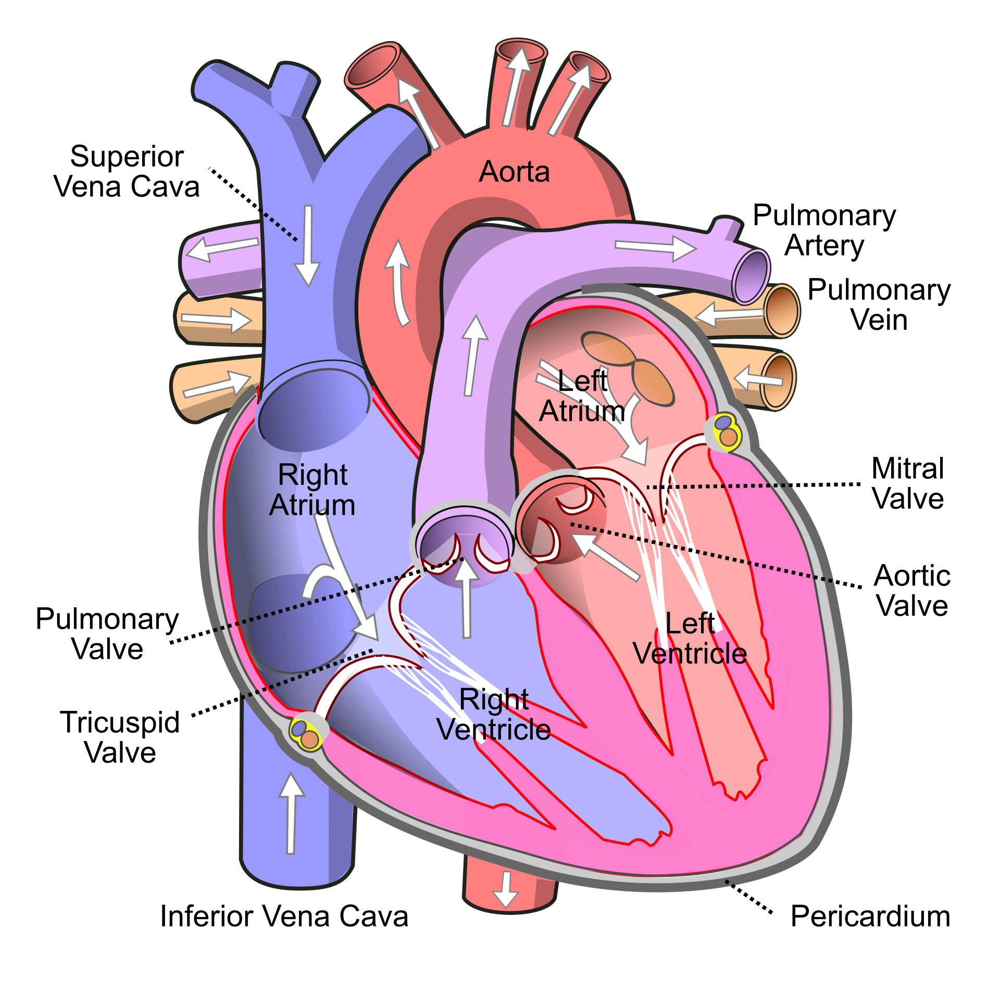

# Background

Researchers have assessed the proteome in different regions of the heart for 3 patients (identifiers 3, 4, and 8). For each patient they sampled the left atrium (LA), right atrium (RA), left ventricle (LV) and the right ventricle (RV). The data are a small subset of the public dataset PXD006675 on PRIDE.

Suppose that researchers are mainly interested in comparing the ventricular to the atrial proteome. Particularly, they would like to compare the left atrium to the left ventricle, the right atrium to the right ventricle, the average ventricular vs atrial proteome and if ventricular vs atrial proteome shifts differ between left and right heart region.

```{r pressure, echo=FALSE, fig.cap="Representation of the heart", out.width = '80%'}

```

# Data

We first import the peptides.txt file. This is the file that contains your peptide-level intensities. For a MaxQuant search [6], this peptides.txt file can be found by default in the "path_to_raw_files/combined/txt/" folder from the MaxQuant output, with "path_to_raw_files" the folder where raw files were saved. In this tutorial, we will use a MaxQuant peptides file from MaxQuant that can be found in the data tree of the SGA2020 github repository https://github.com/statOmics/SGA2020/tree/data/quantification/heart .

## Data import

<details><summary> Click to see background and code </summary><p>

To import the data we use the `QFeatures` package.

We generate the object peptideRawFile with the path to the peptideRaws.txt file.
Using the `grepEcols` function, we find the columns that contain the expression
data of the peptideRaws in the peptideRaws.txt file.

```{r, warning=FALSE, message=FALSE}
library(tidyverse)
library(limma)
library(QFeatures)
library(msqrob2)
library(plotly)

peptidesFile <- "https://raw.githubusercontent.com/statOmics/PDA21/data/quantification/heart/peptides.txt"

ecols <- grep("Intensity\\.", names(read.delim(peptidesFile)))

pe <- readQFeatures(
  table = peptidesFile,
  fnames = 1,
  ecol = ecols,
  name = "peptideRaw", sep="\t")

pe
pe[["peptideRaw"]]
```

We will make use from data wrangling functionalities from the tidyverse package.
The %>% operator allows us to pipe the output of one function to the next function.

```{r}
colData(pe)$location <- substr(
  colnames(pe[["peptideRaw"]]),
  11,
  11) %>%
  unlist %>%  
  as.factor

colData(pe)$tissue <- substr(
    colnames(pe[["peptideRaw"]]),
    12,
    12) %>%
    unlist %>%  
    as.factor

colData(pe)$patient <- substr(
  colnames(pe[["peptideRaw"]]),
  13,
  13) %>%
  unlist %>%  
  as.factor
```


We calculate how many non zero intensities we have per peptide and this
will be useful for filtering.

```{r}
rowData(pe[["peptideRaw"]])$nNonZero <- rowSums(assay(pe[["peptideRaw"]]) > 0)
```


Peptides with zero intensities are missing peptides and should be represent
with a `NA` value rather than `0`.
```{r}
pe <- zeroIsNA(pe, "peptideRaw") # convert 0 to NA
```

</p></details>


## Data exploration

<details><summary> Click to see background and code </summary><p>


`r format(mean(is.na(assay(pe[["peptideRaw"]])))*100,digits=2)`% of all peptide
intensities are missing and for some peptides we do not even measure a signal
in any sample. The missingness is similar across samples.


# Preprocessing

<details><summary> Click to see background and code </summary><p>


This section preforms standard preprocessing for the peptide data. This
include log transformation, filtering and summarisation of the data.

## Log transform the data

```{r}
pe <- logTransform(pe, base = 2, i = "peptideRaw", name = "peptideLog")
limma::plotDensities(assay(pe[["peptideLog"]]))
```

</p></details>


## Filtering

<details><summary> Click to see background and code </summary><p>


### Handling overlapping protein groups
In our approach a peptide can map to multiple proteins, as long as there is
none of these proteins present in a smaller subgroup.

```{r}
pe <- filterFeatures(pe, ~ Proteins %in% smallestUniqueGroups(rowData(pe[["peptideLog"]])$Proteins))
```

### Remove reverse sequences (decoys) and contaminants

We now remove the contaminants, peptides that map to decoy sequences, and proteins
which were only identified by peptides with modifications.

First look to the names of the variables for the peptide features
```{r}
pe[["peptideLog"]] %>%
  rowData %>%
  names
```

No information on decoys.

```{r}
pe <- filterFeatures(pe,~ Potential.contaminant != "+")
```


### Drop peptides that were only identified in one sample

We keep peptides that were observed at least twice.

```{r}
pe <- filterFeatures(pe,~nNonZero >= 2)
nrow(pe[["peptideLog"]])
```

We keep `r nrow(pe[["peptideLog"]])` peptides after filtering.

</p></details>

## Normalize the data

<details><summary> Click to see background and code </summary><p>


```{r}
pe <- normalize(pe, 
                i = "peptideLog", 
                name = "peptideNorm", 
                method = "center.median")
```

</p></details>

### Explore normalized data

<details><summary> Click to see background and code </summary><p>


After  normalisation the density curves for all samples are comparable.

```{r}
limma::plotDensities(assay(pe[["peptideNorm"]]))
```

This is more clearly seen is a boxplot.

```{r,}
boxplot(assay(pe[["peptideNorm"]]), col = palette()[-1],
       main = "Peptide distribtutions after normalisation", ylab = "intensity")
```


We can visualize our data using a Multi Dimensional Scaling plot,
eg. as provided by the `limma` package.

```{r}
limma::plotMDS(assay(pe[["peptideNorm"]]),
  col = colData(pe)$location:colData(pe)$tissue %>%
    as.numeric,
  labels = colData(pe) %>%
    rownames %>%  
    substr(start = 11, stop = 13)
  )
```

The first axis in the plot is showing the leading log fold changes
(differences on the log scale) between the samples.

</p></details>


## Summarization to protein level

<details><summary> Click to see background and code </summary><p>

We use robust summarization in aggregateFeatures. This is the default workflow of aggregateFeatures so you do not have to specifiy the argument `fun`.
However, because we compare methods we have included the `fun` argument to show the summarization method explicitely.

```{r,warning=FALSE}
pe <- aggregateFeatures(pe,
 i = "peptideNorm",
 fcol = "Proteins",
 na.rm = TRUE,
 name = "proteinRobust",
 fun = MsCoreUtils::robustSummary)
```

```{r}
plotMDS(assay(pe[["proteinRobust"]]),
  col = colData(pe)$location:colData(pe)$tissue %>%
    as.numeric,
  labels = colData(pe) %>%
    rownames %>%  
    substr(start = 11, stop = 13)
)
```

</p></details>


# Data Analysis

## Estimation

We model the protein level expression values using `msqrob`.
By default `msqrob2` estimates the model parameters using robust regression.  

```{r, warning=FALSE}
pe <- msqrob(
  object = pe,
  i = "proteinRobust",
  formula = ~ location*tissue + patient)
```

## Inference

Explore Design
```{r}
library(ExploreModelMatrix)
VisualizeDesign(colData(pe),~ location*tissue + patient)$plotlist
```


```{r}
design <- model.matrix(~location*tissue + patient, data = colData(pe))
L <- makeContrast(
  c(
    "tissueV = 0",
    "tissueV + locationR:tissueV = 0",
    "tissueV + 0.5*locationR:tissueV = 0","locationR:tissueV = 0"),
  parameterNames = colnames(design)
  )


pe <- hypothesisTest(object = pe, i = "proteinRobust", contrast = L, overwrite=TRUE)
```

## Evaluate results contrast $\log_2 FC_{V-A}^L$

### Volcano-plot


```{r,warning=FALSE}
volcanoLeft <- ggplot(rowData(pe[["proteinRobust"]])$"tissueV",
                 aes(x = logFC, y = -log10(pval), color = adjPval < 0.05)) +
 geom_point(cex = 2.5) +
 scale_color_manual(values = alpha(c("black", "red"), 0.5)) + theme_minimal()
volcanoLeft
```


### Heatmap

We first select the names of the proteins that were declared signficant.

```{r}
sigNamesLeft <- rowData(pe[["proteinRobust"]])$tissueV %>%
 rownames_to_column("proteinRobust") %>%
 filter(adjPval<0.05) %>%
 pull(proteinRobust)
heatmap(assay(pe[["proteinRobust"]])[sigNamesLeft, ])
```

There are `r length(sigNamesLeft)` proteins significantly differentially expressed at the 5% FDR level.

```{r}
rowData(pe[["proteinRobust"]])$tissueV %>%
  cbind(.,rowData(pe[["proteinRobust"]])$Protein.names) %>%
  na.exclude %>%
  filter(adjPval<0.05) %>%
  arrange(pval)  %>%
  head(10) %>%
  knitr::kable(.) 
```

## Evaluate results contrast $\log_2 FC_{V-A}^R$

### Volcano-plot


```{r,warning=FALSE}
volcanoRight <- ggplot(rowData(pe[["proteinRobust"]])$"tissueV + locationR:tissueV",
                 aes(x = logFC, y = -log10(pval), color = adjPval < 0.05)) +
 geom_point(cex = 2.5) +
 scale_color_manual(values = alpha(c("black", "red"), 0.5)) + theme_minimal()
volcanoRight
```


### Heatmap

We first select the names of the proteins that were declared signficant.

```{r}
sigNamesRight <- rowData(pe[["proteinRobust"]])$"tissueV + locationR:tissueV" %>%
 rownames_to_column("proteinRobust") %>%
 filter(adjPval<0.05) %>%
 pull(proteinRobust)
heatmap(assay(pe[["proteinRobust"]])[sigNamesRight, ])
```

There are `r length(sigNamesRight)` proteins significantly differentially expressed at the 5% FDR level.

```{r}
rowData(pe[["proteinRobust"]])$"tissueV + locationR:tissueV"  %>%
  cbind(.,rowData(pe[["proteinRobust"]])$Protein.names) %>%
  na.exclude %>%
  filter(adjPval<0.05) %>%
  arrange(pval) %>%
  head(10) %>%
  knitr::kable(.)
```


## Evaluate results average contrast $\log_2 FC_{V-A}$

### Volcano-plot


```{r,warning=FALSE}
volcanoAvg <- ggplot(rowData(pe[["proteinRobust"]])$"tissueV + 0.5 * locationR:tissueV",
                 aes(x = logFC, y = -log10(pval), color = adjPval < 0.05)) +
 geom_point(cex = 2.5) +
 scale_color_manual(values = alpha(c("black", "red"), 0.5)) + theme_minimal()
volcanoAvg
```


### Heatmap

We first select the names of the proteins that were declared signficant.

```{r}
sigNamesAvg <- rowData(pe[["proteinRobust"]])$"tissueV + 0.5 * locationR:tissueV" %>%
 rownames_to_column("proteinRobust") %>%
 filter(adjPval<0.05) %>%
 pull(proteinRobust)
heatmap(assay(pe[["proteinRobust"]])[sigNamesAvg, ])
```

There are `r length(sigNamesAvg)` proteins significantly differentially expressed at the 5% FDR level.

```{r}
rowData(pe[["proteinRobust"]])$"tissueV + 0.5 * locationR:tissueV" %>%
  cbind(.,rowData(pe[["proteinRobust"]])$Protein.names) %>%
  na.exclude %>%
  filter(adjPval<0.05) %>%
  arrange(pval) %>%
  head(10) %>%
  knitr::kable(.) 
```


## Interaction

### Volcano-plot


```{r,warning=FALSE}
volcanoInt <- ggplot(rowData(pe[["proteinRobust"]])$"locationR:tissueV",
                 aes(x = logFC, y = -log10(pval), color = adjPval < 0.05)) +
 geom_point(cex = 2.5) +
 scale_color_manual(values = alpha(c("black", "red"), 0.5)) + theme_minimal()
volcanoInt
```

### Heatmap

There were no genes significant at the 5% FDR level.
We return the top 25 genes.

```{r}
sigNamesInt <- rowData(pe[["proteinRobust"]])$"locationR:tissueV" %>%
 rownames_to_column("proteinRobust") %>%
 filter(adjPval<0.05) %>%
 pull(proteinRobust)
hlp <- order((rowData(pe[["proteinRobust"]])$"locationR:tissueV")[,"adjPval"])[1:25]
heatmap(assay(pe[["proteinRobust"]])[hlp, ])
```

There are `r length(sigNamesInt)` proteins significantly differentially expressed at the 5% FDR level.

```{r}
rowData(pe[["proteinRobust"]])$"locationR:tissueV" %>%
  cbind(.,rowData(pe[["proteinRobust"]])$Protein.names) %>%
  na.exclude %>%
  filter(adjPval<0.05) %>%
  head(10) %>%
  knitr::kable(.) 
```


